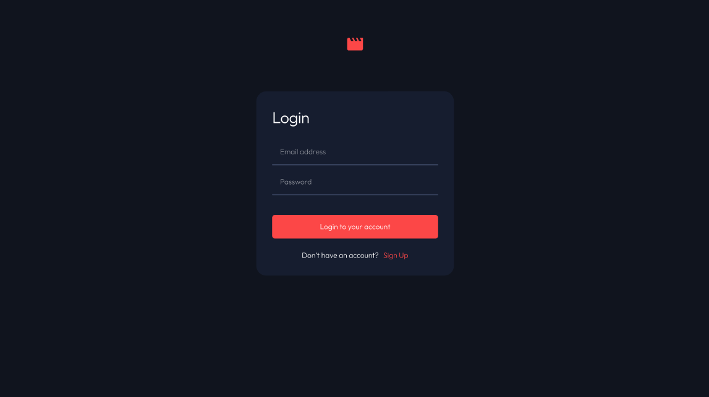
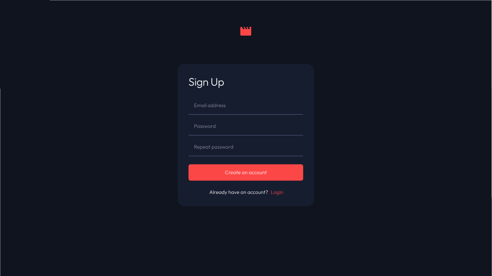
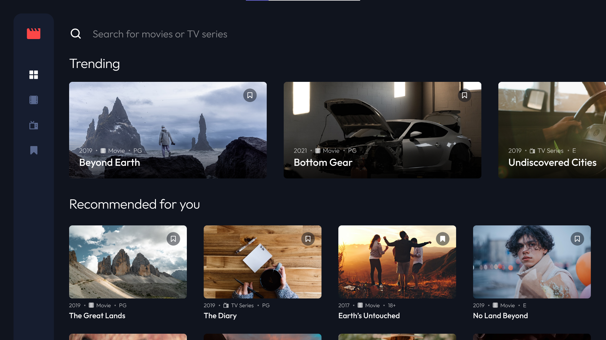
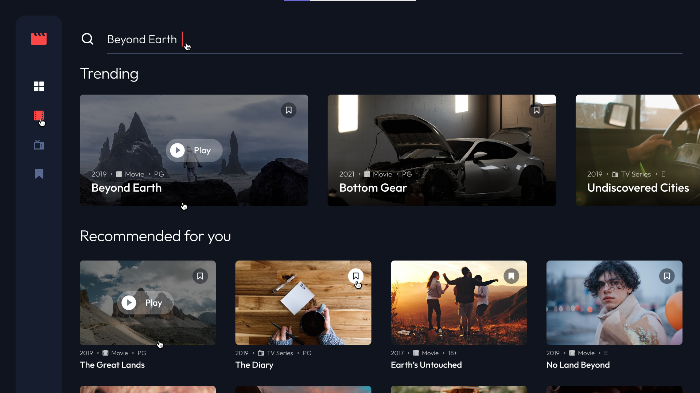
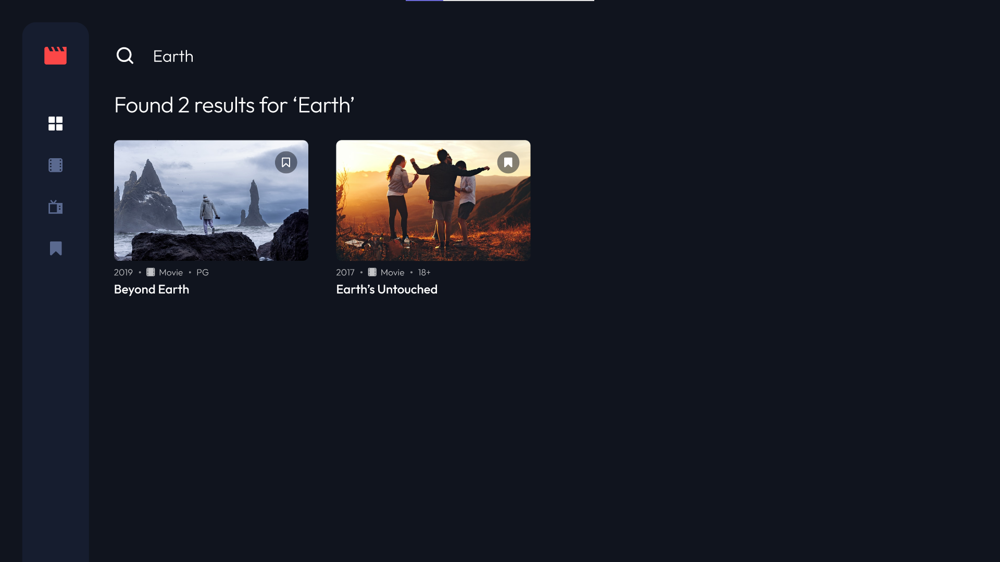
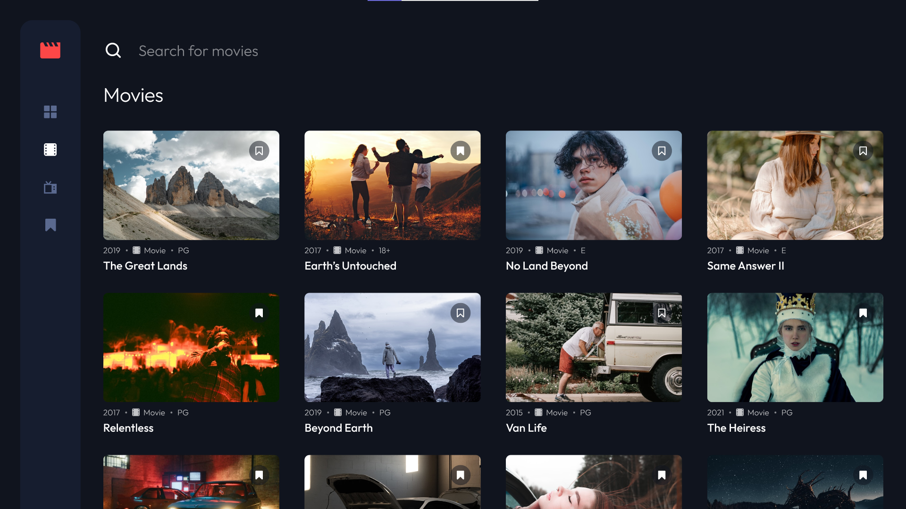

# Geerd Internship – React Frontend Project

🎯 **Projet réalisé dans le cadre d’un stage chez Geerd**

Ce projet consiste à transformer une maquette Figma en une interface web fonctionnelle à l’aide de React.js. Il représente une plateforme d'accueil pour un site (landing page), avec des sections interactives et un design responsive.

## 🔧 Technologies utilisées

- React.js
- HTML / CSS / JavaScript (ES6+)
- Git & GitHub

## 📐 Objectifs

- Reproduire fidèlement un design fourni sous Figma
- Structurer le projet de manière modulaire avec des composants réutilisables
- Appliquer des pratiques propres en CSS et React
- Assurer la responsivité du site

## 📸 Aperçu
Voici quelques aperçus des différentes interfaces et interactions du projet :

### 🔐 Page de connexion



### 📝 Page d'inscription



### 🏠 Page d’accueil



### ✨ Effets au survol / clic



### 🔍 Résultats de recherche



### 📂 Sélection du menu



## 🚀 Lancer le projet en local

```bash
git clone https://github.com/Assadini/Geerd_Inernship.git
cd Geerd_Inernship
npm install
npm start

# 📄 Status

Ce projet a été réalisé dans un contexte professionnel en tant que livrable de stage. Il démontre ma capacité à traduire une vision UI/UX en code propre et fonctionnel.